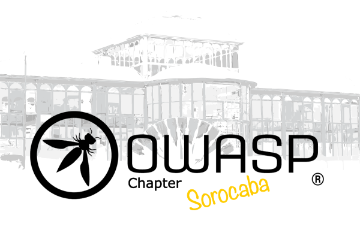

<!--

This is an example of a Project or Chapter Page.  Please change these items to indicate the actual information you wish to present.  In addition to this information, the 'front-matter' above this text should be modified to reflect your actual information.  An explanation of each of the front-matter items is below:
<ul>
<li>layout: This is the layout used by project and chapter pages.  You should leave this value as col-sidebar</li>
<li>title: This is the title of your project or chapter page, usually the name.  For example, OWASP Zed Attack Proxy or OWASP Baltimore</li>
<li>tags: This is a space-delimited list of tags you associate with your project or chapter.  If you are using tabs, at least one of these tags should be unique in order to be used in the tabs files (an example tab is included in this repo) </li>
<li>region: This is the region you are in according to our data</li>
<li>meetup-group: This is the name of your meetup group, usually in the form of OWASP-chapter.  By putting these details here, the section below labeled 'Next Meeting/Event' will get automatically populated with your upcoming meetup events.</li>
</ul>

## Saudações!
A OWASP Sorocaba é um dos mais de 15 capítulos brasileiros entre os mais de 270 Capítulos ativos em todo o mundo. Nosso objetivo é disseminar a missão da OWASP, trazendo a tona questões sobre segurança da informação para todos possam estar cientes dos verdadeiros perigos da má implementação de sistemas Web.
Serão realizados encontros para que as pessoas possam compartilhar conhecimentos, discutir e aprender sobre segurança de software. A organização também tem muitos projetos ativos nos quais os voluntários podem participar para criar códigos e documentos para a comunidade mundial de segurança.
 

 
## Como fazer parte da comunidade?
Como projeto é open-source e voltado para comunidade, o único requisito para entrar é querer participar e contribuir para o projeto. Para fazer parte mande um email para um dos líderes que iremos mandar mais informações.
Quanto aos encontros que serão organizados, todos são livres e de graça, então a partipação estará disponível a todos, sejam nos encontros online ou nos presenciais.
<!--
The Open Web Application Security Project (OWASP) is a nonprofit foundation that works to improve the security of software. All of our projects ,tools, documents, forums, and chapters are free and open to anyone interested in improving application security. 
Chapters are led by local leaders in accordance with the [Chapters Policy](/www-policy/operational/chapters). Financial contributions should only be made online using the authorized online donation button. 
Everyone is welcome and encouraged to participate in our [Projects](/projects/), [Local Chapters](/chapters/), [Events](/events/), [Online Groups](https://groups.google.com/a/owasp.com/){:target='_blank'}, and [Community Slack Channel](https://owasp.slack.com/){:target='_blank'}. We especially encourage diversity in all our initiatives. OWASP is a fantastic place to learn about application security, to network, and even to build your reputation as an expert. We also encourage you to be [become a member](/membership/) or consider a [donation](/donate/) to support our ongoing work.
-->

Próximo Encontro/Evento <!-- You should keep this section as it will populate your meetup events -->
---------------------
Por enquanto não temos encontros planejados

<!--

 -->
